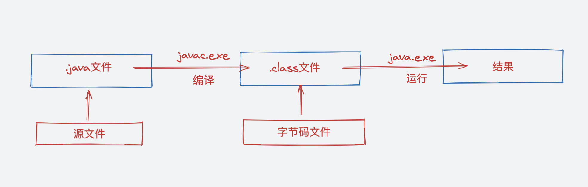

- 将`java`代码编写到扩展名为`.java`的文件中（源文件）
- 通过`javac`命令对改`java`文件进行编译，生成`.class`文件（字节码文件）
- 通过`java`命令运行生成的`.class`文件

- 源文件的基本组成部分是类
- `java`中关键字（被`java`语言赋予了特殊含义）都是小写

- `java`命名规范：
  - 包名：多单词组成时所有字母都小写（xxyyzz）
  - 类名、接口名：多单词组成时，所有单词首字母大写（XxYyZz）
  - 变量名、方法名：多单词组成时，第一个单词首字母小写，其他每个单词首字母大写（xxYyZz）
  - 常量名：所有字母大写，多单词时每个单词用下划线连接（XX_YY_ZZ）
