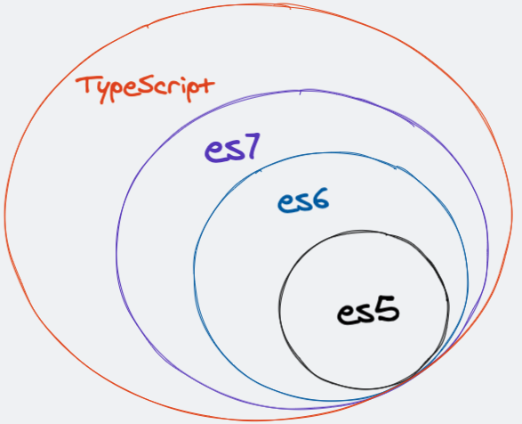

## 介绍

`TypeScript`是`Javascript`的超集，遵循最新的`ES5 / ES6`规范，JavaScript 与 TypeScript 的关系如图所示：



`TypeScript`通过类型注解提供编译时的静态类型检查，在我们编写代码的时候，对代码进行类型检查从而规避很多线上错误。

**`TypeScript`是静态弱类型语言**

- 按照类型检查的时机来分类

  - 动态类型：在运行时进行类型检测（JavaScript 是一门解释型语言，没有编译阶段）
  - 静态类型：在编译时进行类型检测（Java 通过`javac`命令对`java`文件进行编译，生成`.class`文件（字节码文件），在 JVM 中执行）
    `TypeScript`在运行前需要先编译为`JavaScript`，而在编译阶段就会进行类型检查，所以`TypeScript`按照类型检查的时机来分属于静态类型

- 按照是否允许隐式类型转换来分类
  - 强类型
    ```java
    System.out.println(1 + "1"); // 在java编译过程中报错
    ```
  - 弱类型
    ```javascript
    console.log(1 + '1'); // 在js中还是在ts中都可以正常运行
    ```

## 环境搭建

### 全局安装 TypeScript

1.全局安装

```javascript
npm install typescript -g
```

2.创建项目文件夹

```javascript
mkdir ts-demo && cd ts-demo
```

3.项目初始化

```javascript
npm init -y
```

4.生成`tsconfig.json`

```javascript
tsc --init
```

5.在`package.json`中加入配置 ts 编译命令

```javascript
{
  ...
  "main": "src/index.ts",
  "scripts": {
    "build": "tsc", // 可以将ts文件编译成js文件
    "build:w": "tsc -w" // 监控ts文件变化生成js文件
  },
  ...
}
```

6.项目目录结构

```text
- ts-demo
  - src
    index.ts
    index.js
  package.json
  tsconfig.json
```

### rollup 开发环境搭建

1.项目依赖安装

```javascript
// rollup-plugin-typescript2 解析ts
// @rollup/plugin-node-resolve 解析第三方模块
// rollup-plugin-serve 启动一个服务
npm install rollup typescript rollup-plugin-typescript2 @rollup/plugin-node-resolve rollup-plugin-serve -D
```

2.配置 rollup.config.js

```javascript
import path from 'path';
import ts from 'rollup-plugin-typescript2'; // 解析ts的插件
import serve from 'rollup-plugin-serve'; // 启动本地服务
import { nodeResolve } from '@rollup/plugin-node-resolve'; // 解析第三方模块

export default {
  input: 'src/index.ts', // 入口
  output: {
    format: 'iife', // 立即执行
    file: path.resolve('dist/bundle.js'),
    sourcemap: true, // 源码映射
  },
  plugins: [
    // 第三方文件解析
    nodeResolve({
      extensions: ['.js', '.ts'],
    }),
    // ts入口配置文件
    ts({
      tsconfig: path.resolve(__dirname, 'tsconfig.json'),
    }),
    serve({
      open: true,
      openPage: '/public/index.html',
      port: 3000,
      contentBase: '',
    }),
  ],
};
```

3.修改 tsconfig.json

```javascript
{
  ...
  "module": "ESNext",
  "sourceMap": true,
  ...
}
```

4.修改 index.html，引入打包后的 bundle.js

```javascript
<!DOCTYPE html>
<html lang="en">
<head>
  <meta charset="UTF-8">
  <meta http-equiv="X-UA-Compatible" content="IE=edge">
  <meta name="viewport" content="width=device-width, initial-scale=1.0">
  <title>Document</title>
</head>
<body>
  <script src="/dist/bundle.js"></script>
</body>
</html>
```

5.文件目录结构

```text
- ts-demo
  - public
    index.html
  - src
    index.ts
  package.json
  tsconfig.json
```
