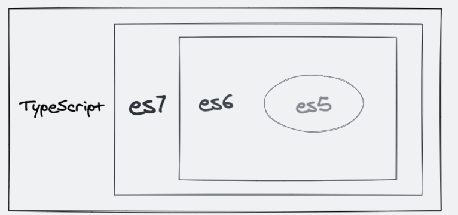

## 介绍

`TypeScript`是`Javascript`的超集，遵循最新的`ES5 / ES6`规范，JavaScript 与 TypeScript 的关系如图所示：



`TypeScript`通过类型注解提供编译时的静态类型检查，在我们编写代码的时候，对代码进行类型检查从而规避很多线上错误。

**`TypeScript`是静态弱类型语言**

- 按照类型检查的时机来分类

  - 动态类型：在运行时进行类型检测（JavaScript 是一门解释型语言，没有编译阶段）
  - 静态类型：在编译时进行类型检测（Java 通过`javac`命令对`java`文件进行编译，生成`.class`文件（字节码文件），在 JVM 中执行）
    `TypeScript`在运行前需要先编译为`JavaScript`，而在编译阶段就会进行类型检查，所以`TypeScript`按照类型检查的时机来分属于静态类型

- 按照是否允许隐式类型转换来分类
  - 强类型
    ```java
    System.out.println(1 + "1"); // 在java编译过程中报错
    ```
  - 弱类型
    ```javascript
    console.log(1 + '1'); // 在js中还是在ts中都可以正常运行
    ```

## 环境搭建

### 全局安装 TypeScript

1.全局安装

```javascript
npm install typescript -g
```

2.创建项目文件夹

```javascript
mkdir ts-demo && cd ts-demo
```

3.项目初始化

```javascript
npm init -y
```

4.生成`tsconfig.json`

```javascript
tsc --init
```

5.在`package.json`中加入配置 ts 编译命令

```javascript
{
  ...
  "main": "src/index.ts",
  "scripts": {
    "build": "tsc", // 可以将ts文件编译成js文件
    "build:w": "tsc -w" // 监控ts文件变化生成js文件
  },
  ...
}
```

6.项目目录结构

```text
- ts-demo
  - src
    index.ts
    index.js
  package.json
  tsconfig.json
```

### rollup 开发环境搭建
